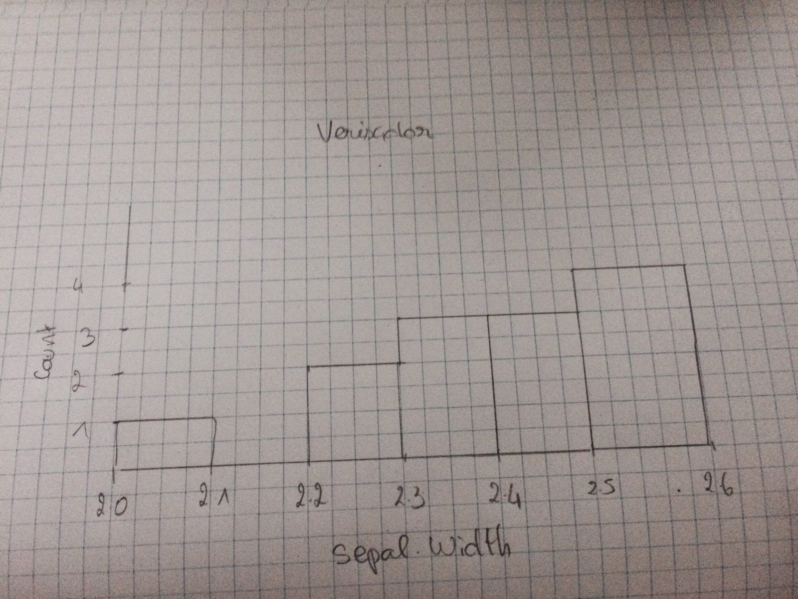

```{r setup, include=FALSE}
knitr::opts_chunk$set(echo = TRUE)
```

## Exercise 1 : Getting started with RMarkdown files
GitHub is a web-based Git or version control repository and Internet hosting service.

## Exercise 2 : Starting R programming
```{r}
possible_outcomes <- c(0, 1, 2, 3, 4, 5)
outcome_probabilities <- c(0.1, 0.5, 0.2, 0.1, 0.05, 0.05)
n_data_points <- 400

set.seed(1)
fake_data_points <- sample(possible_outcomes,
                           n_data_points,
                           replace=T,
                           prob=outcome_probabilities)
set.seed(NULL)

fake_data_set <- tibble::data_frame(`Fake measurement`=fake_data_points)
```

Statement 1.

```{r}

ggplot2::ggplot(fake_data_set, ggplot2::aes(x=`Fake measurement`)) +
  ggplot2::geom_histogram(bins=5, colour="black", fill="lightgrey")
```

Déclaration 1 possible_outcomes est une déclaration de variable, un vecteur d'entiers de longeur 6, allant de 0 à 6
Déclaration 2 outcome_probabilities est une déclaration de variable, un vecteur de réels de longeur 6
Déclaration 3 n_data_points est une déclaration de variable, un entier 400
Déclaration 4 set.seed(1) donne une nombre aléatoire
Déclaration 5 fake_data_points la fonction sample de R, permet d'obtenir des permutations possible, en l'occurence, elle prend comme paramètres possible_outcomes,n_data_points,replace=T,prob=outcome_probabilities, j'en déduis en affichant fake-data-point, grâce à mes connaissances en programmation et quelque recherches internet que possible_outcomes sont les objets à tirer (entier de 0 à 5), n_data_points le nombre de fois ou l'on tire le objets (400), replace=T signifie que ça va les afficher dans l'ordre décroissant des probabiltés et prob=outcome_probabilities est la probabilité que les objets soit tirés (0 à 10% de chance d'être tiré, contrairement à 2 qui à 50% de chance d'être tiré) NB : la somme de toutes les valeurs d'outcome_probabilities font 1.

## Exercise 3
```{r}
iris_groups23 <- dplyr::filter(iris, Species %in% c("versicolor", "virginica"))
ggplot2::ggplot(iris_groups23, ggplot2::aes(x=Sepal.Width)) +
  ggplot2::geom_histogram(colour="black", fill="lightgrey", binwidth=0.1) +
  ggplot2::facet_grid(Species ~ .)
```
Question3a
Pour chaque bars des histogrammes, on a le nombre de fois où l'on a observé la largeur des sépales (en abscisse). Par exemple pour les virginicas, on voit que le plus souvent les sépales ont une largeur de 3cm (pour 12 sépales), et seulement 2,3 cm pour 1 sépale. 

```{r}

```
On ne peut pas vraiment derterminer si ce sous-ensemble est correct car il nous manque beaucoup de données, contrairement aux histogrammes du document.

Question3b
On voit pour l'intervalle [3.0, 3.1[ (cm); que les versicolor on est à 8 cas et pour les virginicas 12, ce qui donne une somme de 20 (12+8), on voit sur l'histogramme des deux groupes regroupés que pour cette invervalle nous somme à 20 ce qui marche. Pour l'intervalle [2.0, 2.1[ on voit qu'on a 0 cas pour les versicolors et 1 pour les virginicas, dans l'histogramme qui concatène les deux, on voit que c'est à 1 (0+1). Pour l'intervalle [2.5, 2.6[ on voit qu'on a 3 pour les versicolors et 3 pour les virginicas, dans l'histogramme qui concatène les deux, on voit que c'est à 6 (3+3). Pour l'intervalle [2.9, 3.0[ on voit qu'on a 2 pour les versicolors et 7 pour les virginicas, dans l'histogramme qui concatène les deux, on voit que c'est à 9 (2+7).

Question3c
L'hypothèse A signifie que si nous avons un échantillon disons "infini" (même si cela est impossible) de virginica et versicolor iris, les deux histogrammes ci-dessus seraient identiques, les variations des largeurs de sépales seraient donc les mêmes pour ces deux espèces.
L'hypothèse B signifie que si nous avons un échantillon "infini", les deux histogrammes seraient différents, on remarquerait des variations de largeur de sépales selon l'éspèce.

Question3d
Considérons que nous sommes en faveur de l'hypothèse A, les deux espèces sont les mêmes en terme de largeur de sépales. En effet, dans les deux premièrs histogrammes, nous voyons que la majorité des sépales ont une largeur entre 2.7 cm et 3cm, nous pouvons donc imaginer qu'avec un échantillon plus grand, les largeurs des sépales seraient pour la plupart entre 2.7 et 3cm pour les deux espèces. Nous voyons dans le dernier histogramme (la concaténation des deux précèdents histogrammes), un histogramme qui ressemble à une gaussienne et que la plupart des des largeurs se trouvent également entre 2.7 et 3cm. Nous pouvons imaginer qu'avec plus de données, les deux premiers histogrammes seraient identiques et le troisième identiques (à echelle plus grande).
```{r}
library(magrittr)
iris_versicolor_subset <- dplyr::filter(iris,
                                        Sepal.Width <= 2.5,
                                        Species == "versicolor") %>%
                          dplyr::select(Sepal.Width, Species)
knitr::kable(iris_versicolor_subset)
```


## Exercise 4
# Install the data: this line is commented out, no need for it if you're
# on the class server, as I've already installed the data package. If you
# want to include any figures in your assignment, or if you want to look at
# the raw data yourself, and you're
# working on your own computer instead of the class server, copy this line,
# without the initial "#" , and run it just once on the console, while
# hooked up to an internet connection. The data should install.
# 
# devtools::install_github("ewan/stats_course", subdir="data/stress_shift")
```{r}
ggplot2::ggplot(stressshift::stress_shift_permit,
                ggplot2::aes(x=Category, fill=Syllable)) +
  ggplot2::geom_bar(position="dodge", colour="black") + 
  ggplot2::scale_fill_brewer(palette="Set3")
```

```{r}
ggplot2::ggplot(stressshift::stress_shift_permit, ggplot2::aes(x=0, fill=Syllable)) +
  ggplot2::geom_bar(position="dodge", colour="black") + 
  ggplot2::scale_fill_brewer(palette="Set3") +
  ggplot2::xlab("") +
  ggplot2::theme(axis.text.x=ggplot2::element_blank(),
                 axis.ticks.x=ggplot2::element_blank()) +
  ggplot2::xlim(c(-1,1))
```
Question 4a 
Nous voyons dans les deux premièrs histogrammes, que le nom "permit" en anglais à l'accent sur la première syllabe dans 35 cas tandis qu'il a l'accent sur la deuxième syllabe dans 11 cas seulement. Tandis que pour le verbe "permit" en anglais, il a l'accent dans seulement 1 cas sur la première syllabe et l'accent dans 45 cas sur la deuxième syllabe. Nous voyons dans la concaténation de ces deux là, verbe et nom confondues que l'accent apparait plus sur la deuxième syllabe (45+11 = 56) que sur la première syllabe (35+1 = 36). Maintenant obeservons nos hypothèses, l'hypothèse A est que "permit" en anglais à le même accent que se soit un nom ou un verbe, contrairement à l'hypothèse B qui dit que le verbe et le nom "permit" en anglais sont différents en terme d'accent. Dans cet exercice le deuxième histogramme ne permet pas de discuter par rapport aux hypothèses. En effet, imaginons que l'accent pour un nom soit à 100% des cas sur la première syllabe et pour un verbe 100% sur la deuxième syllabe, la concaténation des deux histogramme serait à 100% première syllabe, 100% deuxième syllabe. Alors qu'on pourrait conjecturer que la grammaire oblige à mettre l'accent sur la première syllabe pour un nom et sur la deuxième syllabe pour un verbe, donc on serait en faveur de l'hypothèse B qu'ils sont différent en terme d'accent, mais cette déduction serait faite que grâce au premier histogramme et non grâce au deuxième. 

Question 4b 
Nous voyons que l'hypothèse B est plus acceptable. En effet, pour les verbes seulement un cas a l'accent sur la première syllabe pour 45 sur la deuxième syllabe, on peut donc conjecturer grâce à ces données que l'accent pour le verbe "permit" en anglais est exclusivement sur la deuxième syllabe et que l'autre cas est une erreur ou en tout cas pas du tout dans la majorité. Pour les noms la solution est déjà moins tranché, on remarque que pour 35 cas l'accent est sur la première syllabe et sur 11 cas l'accent est sur la deuxième. On voit que majoriterement l'accent est sur la première syllabe mais qu'il arrive quand même que l'accent soit sur la deuxième syllabe. On peut imaginer qu'avec le temps, les deux seront tout autant possibles. Mais même dans ce cas on ne peut pas dire qu'en anglais le nom et le verbe "permit" sont semblables en terme d'accent, alors que la grammaire anglaise oblige l'accent sur la première syllabe pour les verbes, même si elle est plus laxiste pour les noms.

## Exercise 5
Question 5a
Il existe deux types de mesures dans ces histogrammes, nous avons les fréquences (des mesures) d'opacité et de transparence d'un préfixe (la sémantique), et le nombre de fois où se préfixe apparait dans les coprus utilisés (count).

Question 5b
On remarque que dans les deux histogrammes les fréquences sont faibles. En effet pour la plupart la fréquence d'opacité ou de transparence va de 0 à 250. Contrairement aux exercices précédents les données ne sont pas binaires, un mot peut être à la fois transparent et opaque. C'est pour ça que nous n'avons pas d'histogramme de concaténation des données car il est impossible de les concaténer.

Question 5c
L'hypothèse A me semble plus correct car on voit que les comptes de fréquences sont globalement regroupés au même endroit.
